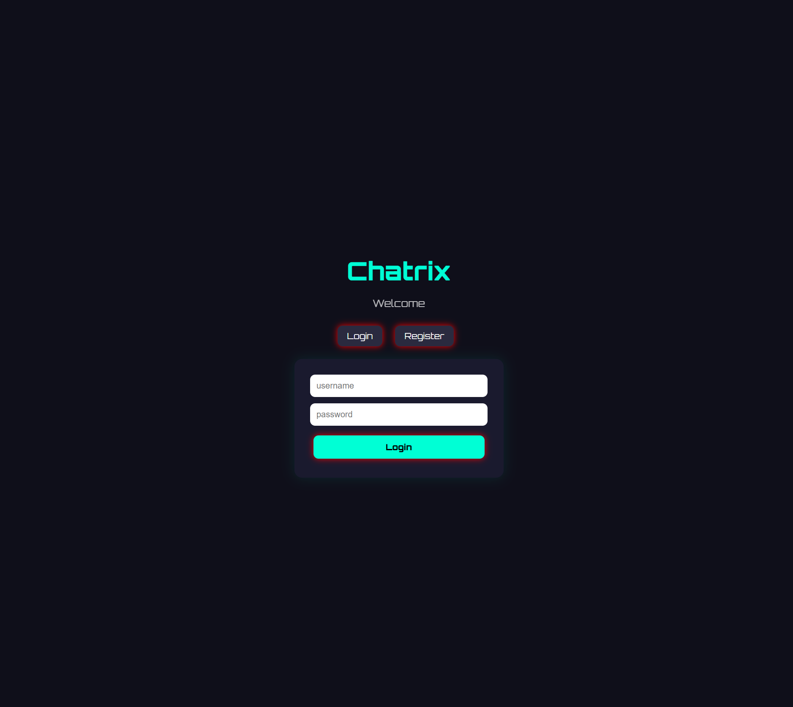

# 💬 Chatrix – Fullstack Real-Time Chat App



Chatrix is a fullstack real-time chat application with authentication, image sharing and WebSocket communication.
authentication systems and real-time communication.

---

## 🚀 Features

- 🔐 User authentication (Register / Login)
- 🪪 JWT-based login system
- 💬 Real-time messaging (Socket.io)
- 🧑‍🤝‍🧑 Multi-user chat support
- 🖼️ Image sharing (Base64 upload)
- 🚪 Logout functionality
- 🔒 Protected routes (login required)
- ⚡ Instant message updates (no refresh needed)
- 🎨 Custom UI with modern CSS styling

---

## 🧱 Tech Stack

### Frontend
- HTML
- CSS
- Vanilla JavaScript

### Backend
- Node.js
- Express.js
- Socket.io
- JSON file storage (for learning purposes)
- JWT Authentication
- bcrypt password hashing

---

## 📁 Project Structure


chatrix/
├── chatrix-client/
│ ├── index.html
│ ├── login.html
│ ├── index.js
│ ├── style.css
│
├── chatrix-server/
│ ├── server.js
│ ├── package.json
│ ├── .env
│ ├── datenbank.json
│ ├── routes/
│ │ └── auth.routes.js
│
└── README.md


---

## ▶️ How to run locally

### 1. Clone the repository
```bash
git clone https://github.com/ivanosna/Chatrix.git
2. Install backend dependencies
cd chatrix-server
npm install
3. Create .env file

Inside chatrix-server:

JWT_SECRET=your_secret_key
4. Start the server
node server.js
5. Open the app

Open in browser:

http://localhost:2000/login.html
🔐 Authentication Flow
User registers account
Password is hashed (bcrypt)
Login returns JWT token
Token stored in localStorage
Chat is only accessible when logged in
📌 Future Improvements
💾 Replace JSON storage with MongoDB
🏠 Chat rooms / channels
👤 User profiles
🟢 Online status system
📱 Mobile responsive redesign
☁️ Deployment (Render / Railway)
🔔 Notifications system
👨‍💻 Author

Made by Ivan 🚀
Junior Software Engineer in progress

⚠️ Note

This project is part of my learning journey and will continuously evolve with new features and improvements.
